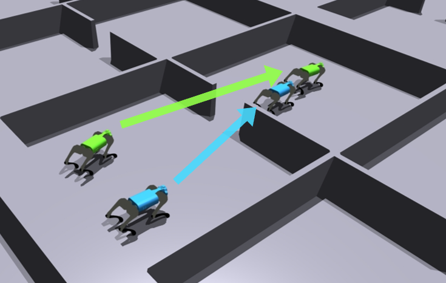
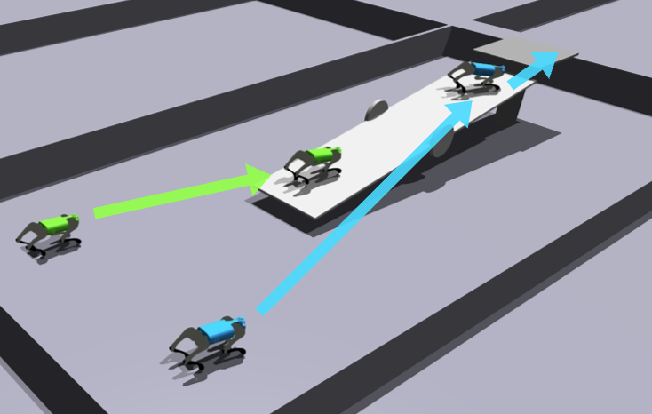
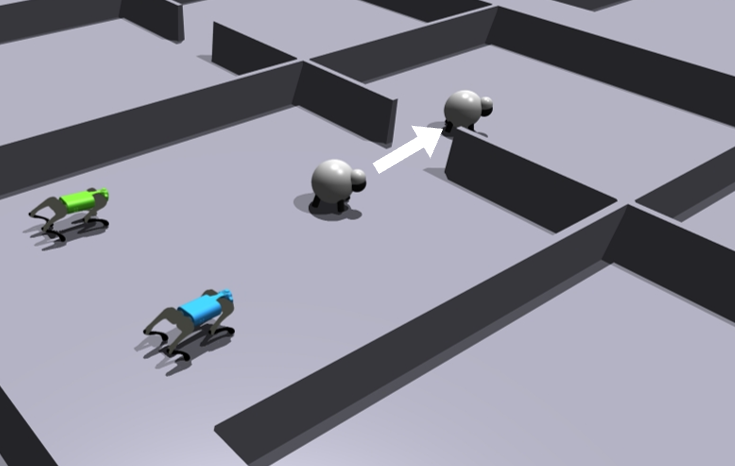
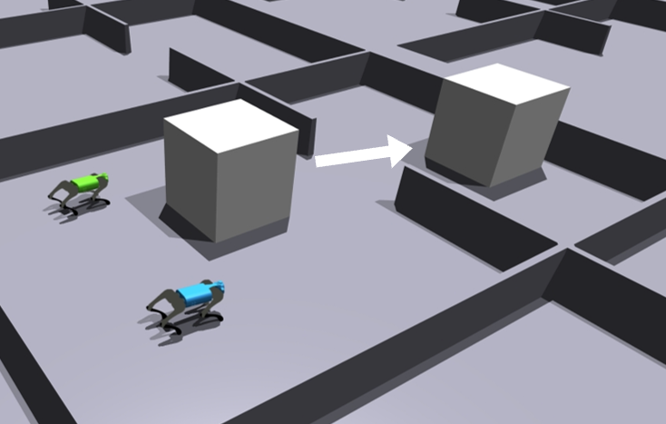
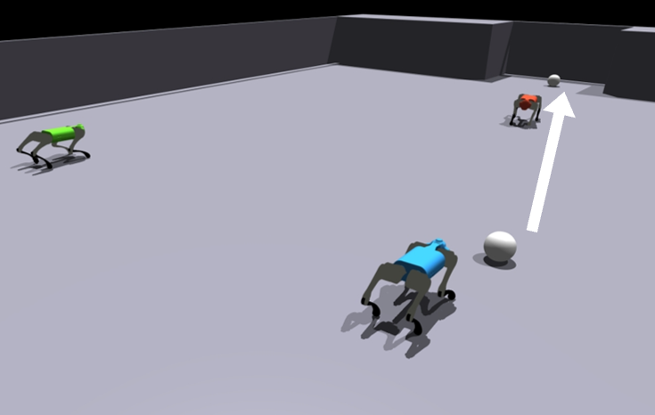
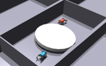
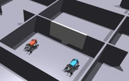
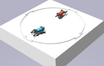
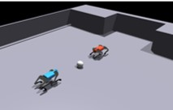
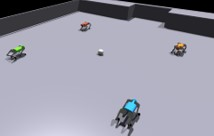

#  Multi-agent Quadruped Environment

Multi-agent Quadruped Environment(MQE) is a multi-functional and easy-to-use quadruped-simulation environment based on Isaac Gym that supports multi-agent tasks. Currently, MQE supports following features:

* Interaction between multiple quadrupeds and articulated objects.
* Train high-level planning policy only with built-in walk policy.
* Build your terrain from blocks like LEGO.
* Click-to-use RL pipeline through [OpenRL](https://github.com/OpenRL-Lab/openrl) on pre-defined cooperative and competitive tasks.

## Useful Links ##

Project Website: https://ziyanx02.github.io/multiagent-quadruped-environment/

Paper: https://arxiv.org/abs/2403.16015

## Installation ##
1. Create a new Python virtual env or conda environment with Python 3.6, 3.7, or 3.8 (3.8 recommended)
    ```
    conda create -n mqe python=3.8
    ```
2. Install PyTorch and Isaac Gym.
    - Install appropriate PyTorch version from https://pytorch.org/.
        ```
        pip3 install torch==1.10.0+cu113 torchvision==0.11.1+cu113 torchaudio==0.10.0+cu113 -f https://download.pytorch.org/whl/cu113/torch_stable.html
        ```
    - Download and install Isaac Gym Preview 4 from https://developer.nvidia.com/isaac-gym. Ubuntu20.04 and Python3.8 recommended.
        ```
        tar -xf IsaacGym_Preview_4_Package.tar.gz
        cd isaacgym/python && pip install -e .
        ```
3. Check Isaac Gym is available by running
    - `cd examples && python 1080_balls_of_solitude.py`
4. Install MQE. Move to the directory of this repository and run
    - `pip install -e .`
5. Check MQE is available by running
    - `python ./test.py`

## Code Structure ##

Environment for each task is defined by:
- a class for controlling objects involved in the task. `./mqe/envs/go1/go1.py` is a base class for Unitree Go1 robot with locomotion policy implemented in [walk-these-ways](https://github.com/Improbable-AI/walk-these-ways). `./mqe/envs/npc/` includes several classes created for different interactive objects.
- a wrapper to specify observations, actions, rewards, and infos. `./mqe/envs/wrappers/` includes several wrappers for reference.
- a config file to specify all the configuration about the environment, including configs for simulation, terrain registration, robot assets, etc. Config files use inheritance. `./mqe/envs/configs/` includes the config files of pre-defined tasks. To explore more available configurations, please check config files in `./mqe/envs/base/`, `./mqe/envs/field/` and `./mqe/envs/go1/`, there should be no intersections between these config files for clearance.

Blocks used in terrain registration is defined in `./mqe/utils/terrain/barrier_track.py`.

## Usage ##
1. Try different tasks

    `python ./test.py`

    - Task could be specified in `./test.py`

2. Train using OpenRL (collaborative)

    `python ./openrl_ws/train.py --algo ALGO_NAME --task TASK_NAME`
    - `--num_envs NUM_ENVS` to specify the number of parallel simulated environments
    - `--train_timesteps NUM_STEPS` to specify the number of environment steps during the training
    - `--sim_device SIM_DEVICE` to specify device for simulation
    - `--rl_device RL_DEVICE` to specify device for running OpenRL
    - `--headless` to render headlessly
    - `--seed RANDOM_SEED` to specify random seed
    - `--config /PATH/TO/CONFIG` to speicy cinfiguration for OpenRL
    - `--use_wandb` to use WanDB
    - `--use_tensorboard` to use TensorBoard

3. Evaluate trained policy (collaborative)

    `python ./openrl_ws/test.py --algo ALGO_NAME --task TASK_NAME --checkpoint /PATH/TO/CHECKPOINT`
    - `--record_video` to record video (frames)
    - `--algo ALGO_NAME` should be specified as well as `--checkpoint`

4. Create new task

    Currently, existing tasks are exhibited in `./mqe/envs/utils.py` for reference. To create new terrain blocks, please add corresponding `BarrierTrack.get_BLOCK_NAME_block()` function in `./mqe/utils/terrain/barrier_track.py`. Please refer to the following tasks for different kinds of new task: `go1gate` for tasks without objects; `go1seesaw` for tasks with fixed or free objects; `go1sheep-easy` for tasks with objects serving as NPC; `go1football-defender` for tasks with robots serving as NPC.

## Existing Tasks ##

The Task Name in the following table corresponds to `--task TASK_NAME` in task selection. Check `./mqe/envs/utils.py` for the latest list of existing tasks.

### Collaborative Tasks ###
| Task Name | Task Description | Demonstration |
|:-:|:-:|:-:|
|go1gate|Two quadrupeds go through one narrow gate sequentially. This task requires the agents to avoid possible collisions between two robots.||
|go1seesaw|Two quadrupeds utilize a seesaw to climb on a suspended platform. This task requires the agents to understand the mechanism of the seesaw and maintain synchrony while climbing up the seesaw.||
|go1sheep-easy|Two quadrupeds play the role of sheepdogs to herd one sheep to go through the gate. Sheep will run away when the sheepdog approaches.||
|go1sheep-hard|Two quadrupeds play the role of sheepdogs to herd nine sheep to go through the gate.||
|go1pushbox|Two quadrupeds push the heavy box through the gate.||
|go1football-defender|An opposite quadruped plays as a defender, who will keep at the middle point between the ball and the goal. Two quadrupeds need to collaborate to kick the ball into the goal.||

### Competitive Tasks ###

| Task Name | Task Description | Demonstration |
|:-:|:-:|:-:|
|go1tug|Two quadrupeds push the cylinder in opposite directions.||
|go1revolvingdoor|There is a revolving door placed at the center of the field, and both the quadrupeds target on going to the other side.||
|go1bridge|Two quadrupeds are placed on opposite sides of a narrow bridge. The target is to get to the other side while avoid being pushed down the bridge.||
|go1bridgewrestling|Two quadrupeds are placed on a Sumo wrestling arena. The target for both sides is to push the other quadruped out of the circle or let the rival fall.||
|go1football-1vs1|Football game with 1 player each side.||
|go1football-2vs2|Football game with 2 player each side.||

## Trouble Shooting ##

1. If you get the following error: `ImportError: libpython3.8m.so.1.0: cannot open shared object file: No such file or directory`, it is also possible that you need to do `export LD_LIBRARY_PATH=/PATH/TO/LIBPYTHON/DIRECTORY` / `export LD_LIBRARY_PATH=/PATH/TO/CONDA/envs/YOUR_ENV_NAME/lib`. You can also try: `sudo apt install libpython3.8`.

2. If you get the following error: `AttributeError: module 'numpy' has no attribute 'float'.`, it's because of the version of package `numpy`. First uninstall `numpy` by `pip uninstall numpy`, and install `numpy` of specific version by `pip install numpy==1.20.3`.

3. If you get `Segmentation fault (core dumped)` while rendering frames using A100/A800, please switch to GeFoece graphic cards.

## Citing MQE ##

If our work has been helpful to you. please feel free to cite us:

```
@misc{xiong2024mqe,
      title={MQE: Unleashing the Power of Interaction with Multi-agent Quadruped Environment}, 
      author={Ziyan Xiong and Bo Chen and Shiyu Huang and Wei-Wei Tu and Zhaofeng He and Yang Gao},
      year={2024},
      eprint={2403.16015},
      archivePrefix={arXiv},
      primaryClass={cs.RO}
}
```
